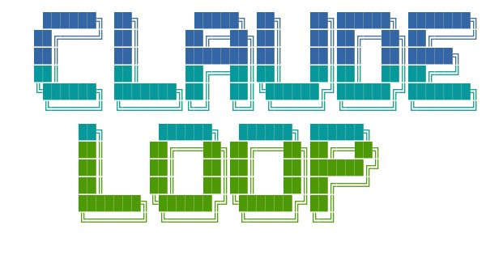
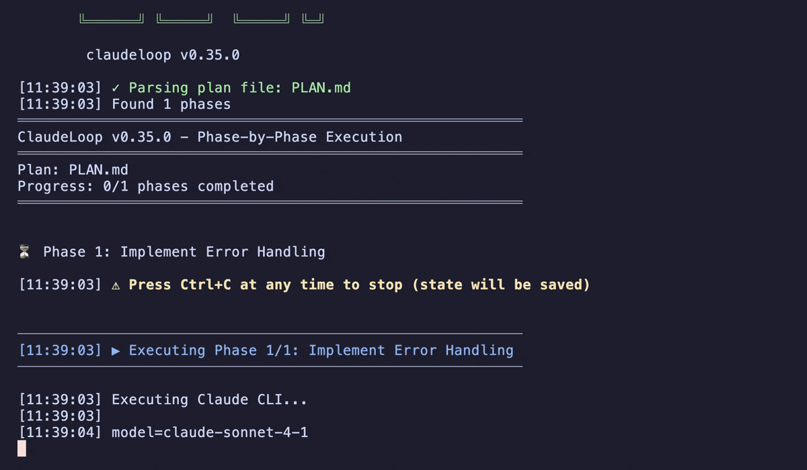
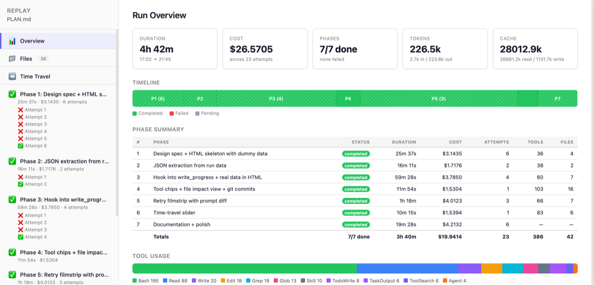
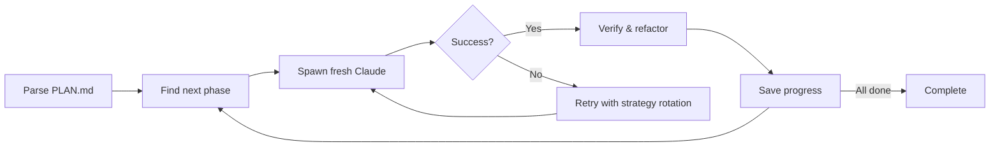
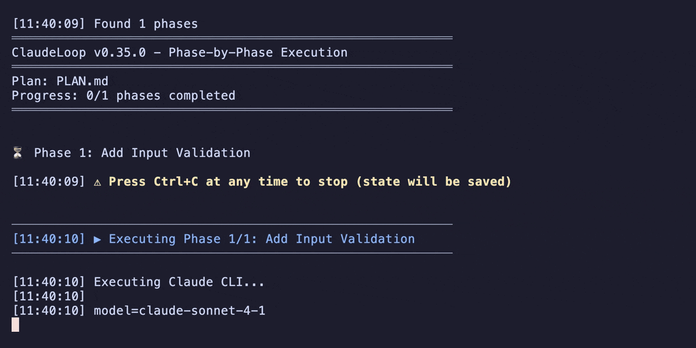
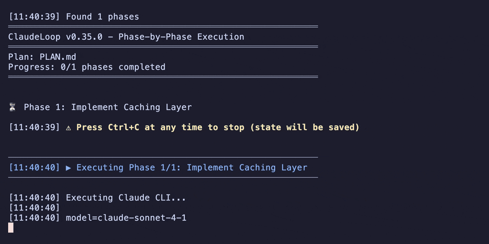

<p align="center">
  
</p>

# ClaudeLoop

[](https://github.com/chmc/claudeloop/releases)
[](https://github.com/sponsors/chmc)

> **Ship complex AI coding projects that actually finish.** ClaudeLoop splits your plan into phases and gives each one a fresh Claude instance — so phase 10 is as sharp as phase 1.

<p align="center">
  
</p>

## Why ClaudeLoop?

Long AI coding sessions hit a wall: context fills up, the model forgets earlier work, and quality drops. ClaudeLoop takes a different approach — each phase gets a **brand-new Claude CLI instance** with fresh context, and progress is saved between phases. If something fails, it retries automatically with escalating strategies.

## Install

Requires [Claude CLI](https://docs.anthropic.com/en/docs/claude-code) and [git](https://git-scm.com/). Pure POSIX shell — zero runtime dependencies.

```sh
curl -fsSL https://raw.githubusercontent.com/chmc/claudeloop/main/install.sh | sh
```

See [QUICKSTART.md](QUICKSTART.md) for beta versions, uninstall, and alternative install methods.

## Quick Start

**1. Write a plan** — create `PLAN.md` in your project:

```markdown
# My Project

## Phase 1: Setup
Initialize the project structure and install dependencies.

## Phase 2: Core Logic
**Depends on:** Phase 1

Implement the main business logic.

## Phase 3: Tests
**Depends on:** Phase 2

Write tests for all core functionality.
```

**2. Run it:**

```sh
claudeloop
```

> **Tip:** Run `claudeloop --dry-run` first to validate your plan without executing.

<p align="center">
  
</p>

## Features

### Execution

**Fresh context every phase** — Each phase spawns a new Claude CLI instance. No context window degradation, no matter how many phases you have.

**Dependency graph** — Phases declare dependencies (`**Depends on:** Phase 1, Phase 3`). ClaudeLoop resolves execution order automatically.

**Smart retries** — Automatic strategy rotation when a phase fails: early retries use the full prompt, later retries strip boilerplate and focus on the specific error. Quota-aware delays (15 min) for rate limits.

**Network resilience** — Detects network failures, rolls back partial file changes, and resumes automatically.

**AI plan decomposition** — `--ai-parse` turns free-form notes into structured phases. Write bullet points, get an executable plan.

### Quality

**Verification** — `--verify` spawns a fresh read-only Claude to check each phase's output with verdict-based pass/fail.

**Auto-refactor** — `--refactor` runs automatic code quality passes after each phase. Rolls back on failure to preserve your work.

**Safe interrupts** — Press Ctrl+C at any time. Progress is saved and `--continue` resumes exactly where you left off. Edit `PLAN.md` between runs — ClaudeLoop detects changes and carries forward progress.

### Observability

**Live monitoring** — `claudeloop --monitor` from a second terminal. Spinner shows real-time todo and task progress.

<p align="center">
  
</p>

**Replay report** — Auto-generated self-contained HTML at `.claudeloop/replay.html`. Updates live during execution — just refresh your browser.

- **Execution timeline** — phase overview with status, duration, cost, and token usage
- **Retry filmstrip** — side-by-side attempt comparison with prompt diffs
- **Time-travel slider** — scrub through execution history
- **Tool usage** — which tools Claude called and how often
- **File impact** — which files were touched per phase
- **Git commits** — commits associated with each phase

Works on archived runs too. Regenerate with `claudeloop --replay`.

<p align="center">
  
</p>

## How It Works



1. Parse `PLAN.md` into phases with dependencies
2. Find the next runnable phase (dependencies met, not yet completed)
3. Spawn a fresh `claude` CLI instance with the phase prompt
4. On success: optionally verify (`--verify`) then refactor (`--refactor`)
5. Save result to `PROGRESS.md`
6. On failure: retry with strategy rotation (full → stripped → targeted error-focused)
7. Repeat until all phases complete or Ctrl+C

---

<details>
<summary><strong>All CLI Options</strong></summary>

```
--plan <file>        Plan file to execute (default: PLAN.md)
--progress <file>    Progress file (default: PROGRESS.md)
--reset              Reset progress and start from beginning
--continue           Resume from last checkpoint
--phase <n>          Start from specific phase number
--mark-complete <n>  Mark a phase as completed (use when a phase succeeded but was logged as failed)
--recover-progress   Reconstruct PROGRESS.md from .claudeloop/logs/ (use after progress corruption)
--force              Kill any running instance and take over (preserves progress)
--dry-run            Validate plan without executing
--max-retries <n>    Max retry attempts per phase (default: 15)
--quota-retry-interval <s>  Seconds to wait after quota limit error (default: 900)
--max-phase-time <s> Kill claude after N seconds per phase, then retry (default: 0, disabled)
--idle-timeout <s>   Exit if no stream activity for N seconds (default: 600, 0=disabled)
--verify-timeout <s> Kill verification after N seconds (default: 300)
--verify             Verify each phase with a fresh read-only Claude instance
--refactor           Auto-refactor code after each phase
--refactor-max-retries <n>  Max refactor attempts per phase (default: 20)
--ai-parse             Use AI to decompose plan into granular phases
--granularity <level>  Breakdown depth: phases, tasks, steps (default: tasks)
--simple             Plain output (no colors)
--dangerously-skip-permissions  Bypass claude permission prompts (use with caution)
--phase-prompt <file>  Custom prompt template for phase execution
--archive            Archive current run state and exit
--list-archives      List archived runs and exit
--restore <name>     Restore an archived run and exit
--replay [archive]   Regenerate replay.html (optionally for an archived run)
--monitor            Watch live output of a running claudeloop instance
--version, -V        Print version and exit
--help               Show help
```

</details>

<details>
<summary><strong>Config File</strong></summary>

On first run, ClaudeLoop automatically creates `.claudeloop/.claudeloop.conf` with the active settings. You can then run `claudeloop` with no arguments and it will reuse those settings.

If you pass CLI arguments on a subsequent run, only the explicitly set keys are updated in the conf file.

`--dry-run` never writes or modifies the conf file.

**Persistable keys:**

| Key | CLI flag | Default |
|---|---|---|
| `PLAN_FILE` | `--plan` | `PLAN.md` |
| `PROGRESS_FILE` | `--progress` | `.claudeloop/PROGRESS.md` |
| `MAX_RETRIES` | `--max-retries` | `15` |
| `SIMPLE_MODE` | `--simple` | `false` |
| `SKIP_PERMISSIONS` | `--dangerously-skip-permissions` | `false` |
| `BASE_DELAY` | — | `3` |
| `PHASE_PROMPT_FILE` | `--phase-prompt` | _(empty)_ |
| `QUOTA_RETRY_INTERVAL` | `--quota-retry-interval` | `900` |
| `MAX_PHASE_TIME` | `--max-phase-time` | `0` |
| `IDLE_TIMEOUT` | `--idle-timeout` | `600` |
| `VERIFY_TIMEOUT` | `--verify-timeout` | `300` |
| `AI_PARSE` | `--ai-parse` | `false` |
| `GRANULARITY` | `--granularity` | `tasks` |
| `VERIFY_PHASES` | `--verify` | `false` |
| `REFACTOR_PHASES` | `--refactor` | `false` |

Example `.claudeloop/.claudeloop.conf`:

```
PLAN_FILE=my-plan.md
MAX_RETRIES=15
SKIP_PERMISSIONS=true
```

The conf file is plain text — edit or delete it freely. One-time flags (`--reset`, `--phase`, `--mark-complete`, `--dry-run`, `--verbose`, `--continue`) are never persisted.

</details>

<details>
<summary><strong>Plan File Format</strong></summary>

```markdown
# Project Title

## Phase 1: Title
Description of what Claude should do.

## Phase 2: Title
**Depends on:** Phase 1

Description of the next task.
```

Rules:
- Headers must be `## Phase N: Title` where N is a number in ascending order (case-insensitive: `Phase`, `phase`, `PHASE` all work)
- Gaps and decimals are allowed: `1, 2, 2.5, 2.6, 3` is valid (useful for inserting sub-phases)
- Dependencies: `**Depends on:** Phase X, Phase Y` on the first line after the header
- Phases can only depend on earlier phases

See `examples/PLAN.md.example` for a complete example.

</details>

<details>
<summary><strong>Custom Phase Prompts</strong></summary>

By default ClaudeLoop generates a prompt for each phase from the phase title and description.
Pass `--phase-prompt <file>` to use your own template instead.

**Substitution mode** — if the template contains `{{}}` placeholders, they are replaced with phase data:

| Placeholder | Value |
|---|---|
| `{{PHASE_NUM}}` | Phase number (e.g. `2.5`) |
| `{{PHASE_TITLE}}` | Phase title |
| `{{PHASE_DESCRIPTION}}` | Phase description |
| `{{PLAN_FILE}}` | Path to the plan file |

Example template:

```
/implement {{PHASE_TITLE}}

Plan: @{{PLAN_FILE}}
Phase: {{PHASE_NUM}}

{{PHASE_DESCRIPTION}}
```

**Append mode** — if the template contains no `{{}}` placeholders, the phase data is appended as a markdown block at the end of your template. Useful for static system-level instructions.

You can also set the template path in `.claudeloop/.claudeloop.conf`:

```
PHASE_PROMPT_FILE=prompts/my-template.md
```

</details>

<details>
<summary><strong>AI Plan Decomposition</strong></summary>

Instead of writing a structured plan manually, use `--ai-parse` to let AI decompose any plan file into phases:

```bash
# Decompose a free-form plan into tasks (default granularity)
claudeloop --plan ideas.md --ai-parse

# Use finer granularity for smaller steps
claudeloop --plan ideas.md --ai-parse --granularity steps

# Preview without executing
claudeloop --plan ideas.md --ai-parse --dry-run
```

The AI parser:
1. Reads any plan format (free text, bullet lists, structured docs)
2. Calls `claude --print` to **extract** original content into `## Phase N:` format (preserves descriptions, no rewriting)
3. Verifies completeness, correctness, ordering, and content preservation against the original
4. On verification failure, offers retry/continue/abort — retries with feedback up to 3 times (configurable via `AI_RETRY_MAX`)
5. Shows you the plan for confirmation before proceeding

The generated plan is saved to `.claudeloop/ai-parsed-plan.md` and reused on `--continue`.

</details>

<details>
<summary><strong>Replay Report</strong></summary>

ClaudeLoop automatically generates a self-contained HTML report at `.claudeloop/replay.html` during execution. Open it in any browser to inspect your run — no server or external dependencies required.

<p align="center">
  
</p>

The report updates automatically as phases complete — just refresh your browser. It also works on archived runs (`.claudeloop/archive/*/replay.html`).

To regenerate `replay.html` on demand (e.g., after updating the template):

```sh
claudeloop --replay                    # Active run
claudeloop --replay 20260316-143022    # Archived run
```

</details>

<details>
<summary><strong>Troubleshooting</strong></summary>

**`claude: command not found`** — install the Claude CLI and ensure it's in your PATH

**`Not in a git repository`** — run `git init && git add . && git commit -m "init"` in your project

**Phase keeps failing** — check `.claudeloop/logs/phase-N.log`. ClaudeLoop automatically rotates retry strategies: early retries use the full phase description, later retries strip boilerplate and focus on the specific error. If all retries fail, consider breaking complex phases into smaller ones

**Phase completes but no changes made** — Claude is asking for write permissions it can't grant non-interactively. Re-run with `--dangerously-skip-permissions`, or grant permissions in Claude settings. ClaudeLoop also detects when Claude exits successfully but made no write actions (Edit, Write, NotebookEdit, or Agent tool calls) and treats the phase as failed for automatic retry.

**Phase marked as failed but the work was done** — ClaudeLoop automatically detects this: if a background sub-invocation caused the Claude process to exit non-zero but the main session completed real work (turns > 0 in the log), the phase is marked completed with a warning. If auto-detection misses a case, use `--mark-complete <n>` to override the status manually:

    claudeloop --mark-complete 1

If the repo has uncommitted changes from the prior session, ClaudeLoop detects the existing progress and skips the uncommitted-changes gate automatically.

**Progress corrupted (wrong plan file overwrote PROGRESS.md)** — ClaudeLoop now backs up PROGRESS.md before overwriting and warns on drastic plan changes. If progress was already lost, reconstruct it from execution logs:

    claudeloop --plan your-plan.md --recover-progress

**Run archiving** — When all phases complete successfully, ClaudeLoop auto-archives the run state (PROGRESS.md, logs, signals) to `.claudeloop/archive/{timestamp}/`. On next startup with a completed run, it prompts to archive before starting fresh. Manual control:

    claudeloop --archive           # Archive current run
    claudeloop --list-archives     # List past runs
    claudeloop --restore 20260316-143022  # Restore a past run

Disable auto-archive with `_CLAUDELOOP_NO_AUTO_ARCHIVE=1`.

**Orphan log detection** — When ClaudeLoop finds log files for phases not in the current plan (e.g., after switching between `--ai-parse` and manual plans), it warns and offers options:

- If `.claudeloop/ai-parsed-plan.md` exists: `[r]ecover` (recommended) switches to the AI-parsed plan and reconstructs progress from logs automatically, `[c]ontinue`, or `[a]bort`
- If no AI-parsed plan exists: `[c]ontinue` or `[a]bort` (with `--reset` hint)

</details>

<details>
<summary><strong>See It In Action</strong></summary>

**Verification** — a read-only Claude checks each phase's work:

<p align="center">
  
</p>

**Auto-refactor** — automatic code quality improvements after each phase:

<p align="center">
  
</p>

</details>

## Documentation

- [Quick Start Guide](QUICKSTART.md)
- [Example Plan](examples/PLAN.md.example)
- [Architecture Decisions](docs/adr/)
- [Releases & Changelogs](https://github.com/chmc/claudeloop/releases)

## Credits

Inspired by [ralph](https://github.com/snarktank/ralph) by snarktank.

## Author

**Aleksi Sutela** ([chmc](https://github.com/chmc)) — if you find ClaudeLoop useful, [consider sponsoring](https://github.com/sponsors/chmc).
