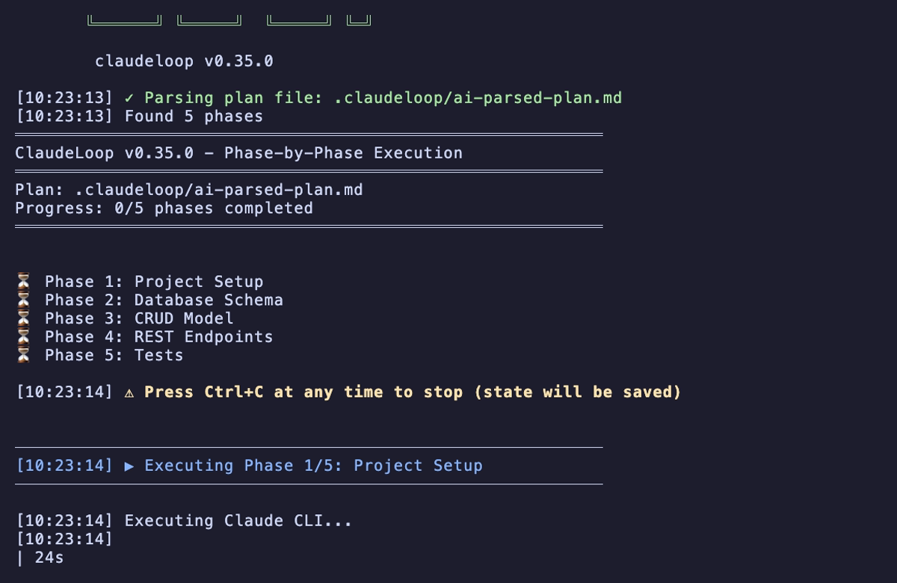
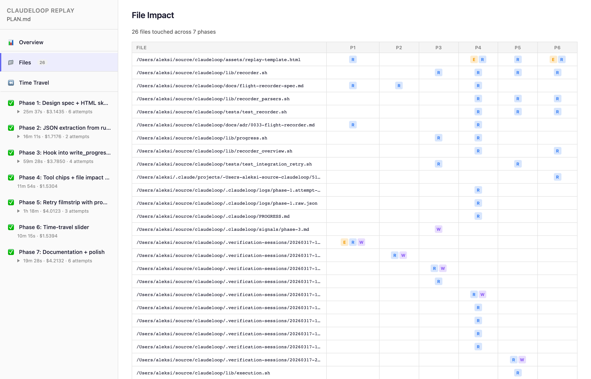
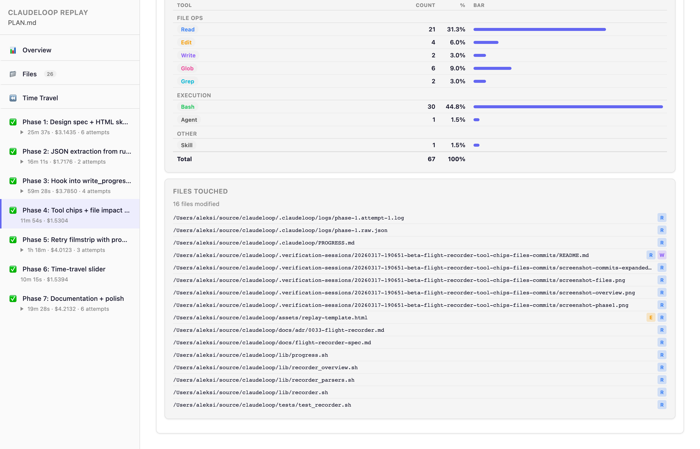
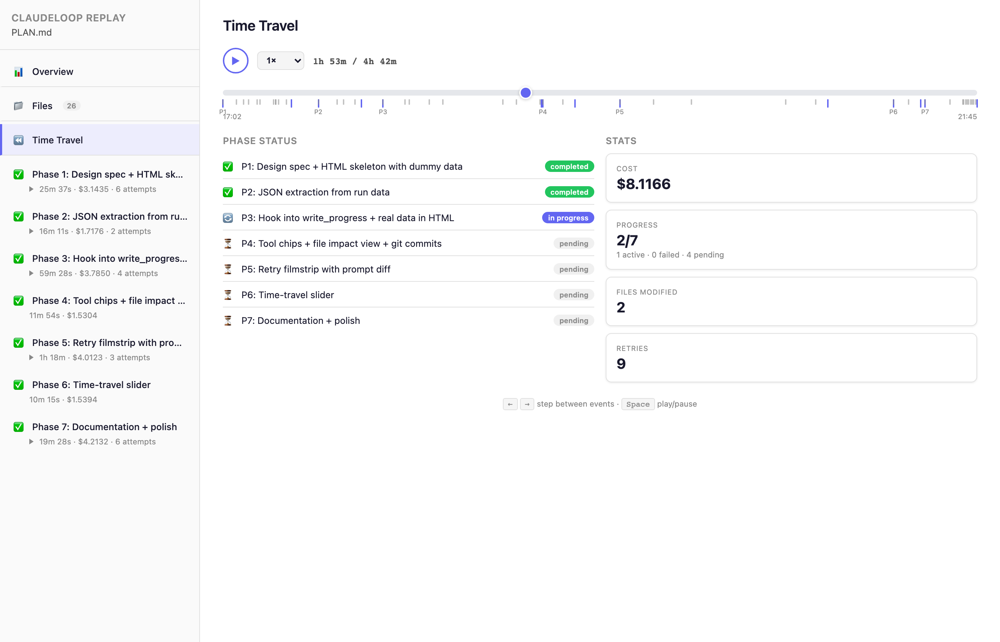
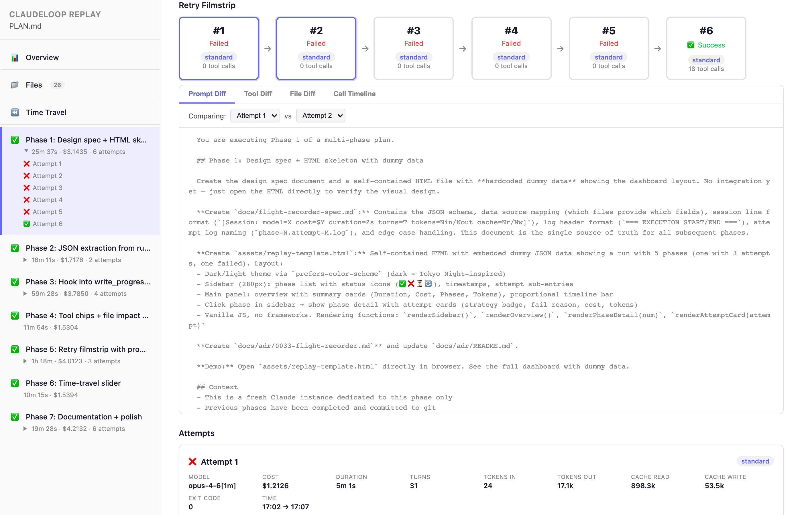

<p align="center">
  
</p>

<p align="center">
  <strong>Ship ambitious AI coding projects.</strong><br>
  Each task gets a fresh Claude — sharp from first to last.
</p>

<p align="center">
  <a href="https://github.com/chmc/claudeloop/releases"></a>
  <a href="https://github.com/chmc/claudeloop/stargazers"></a>
  
  
  <a href="https://github.com/sponsors/chmc"></a>
</p>

<p align="center">
  
</p>

## The Problem

Long AI coding sessions hit a wall. Context fills up, the model forgets earlier decisions, and quality degrades — task 10 is dumber than task 1. You end up babysitting, copying context manually, or just accepting worse output.

ClaudeLoop fixes this. Describe what you want — structured phases or just free-form notes — and each task gets a **brand-new Claude instance** with fresh context. Progress is saved between tasks. If something fails, it retries automatically with escalating strategies.

## Install

```sh
curl -fsSL https://raw.githubusercontent.com/chmc/claudeloop/main/install.sh | sh
```

Requires [Claude CLI](https://docs.anthropic.com/en/docs/claude-code) and [git](https://git-scm.com/). Pure POSIX shell — zero runtime dependencies.

See [QUICKSTART.md](QUICKSTART.md) for beta versions, uninstall, and alternative install methods.

## Features

| | | |
|---|---|---|
| **Fresh Context** | **Dependency Graph** | **Smart Retries** |
| Each task spawns a new Claude instance. No context degradation, ever. | Declare dependencies between tasks. ClaudeLoop resolves execution order automatically. | Strategy rotation on failure: full prompt → stripped → error-focused. Quota-aware delays. |
| **Natural Language Plans** | **Verification** | **Auto-Refactor** |
| Write bullet points or rough notes. `--ai-parse` decomposes them into phases with dependencies. | `--verify` spawns a read-only Claude to check each task with pass/fail verdicts. | `--refactor` runs code quality passes after each task. Rolls back on failure. |

### ClaudeLoop vs. the alternatives

| | Single long session | Manual splitting | **ClaudeLoop** |
|---|---|---|---|
| **Context quality** | Degrades over time | Fresh (manual effort) | **Fresh (automatic)** |
| **Error recovery** | Manual retry | Manual retry | **Auto-retry with strategy rotation** |
| **Resume after interrupt** | Start over | Manual bookkeeping | **`--continue` resumes exactly** |
| **Cost tracking** | None | None | **Per-task cost in replay report** |
| **Verification** | Trust the output | Manual review | **Fresh read-only Claude checks work** |
| **Code quality** | Hope for the best | Manual cleanup | **Auto-refactor with rollback** |
| **Observability** | Scroll terminal | Scroll terminal | **Live monitoring + HTML replay** |
| **Plan authoring** | Write it yourself | Write it yourself | **Free-form notes → auto-structured** |

## Quick Start

**1. Jot down what you want built** — create `PLAN.md` in your project:

```markdown
# Todo API

- Set up Express + SQLite project structure
- Database schema for todos (id, title, completed, timestamps)
- CRUD model with prepared statements and error handling
- REST endpoints: GET/POST/PUT/DELETE /todos
- Tests for model and API (aim for >90% coverage)
```

**2. Let ClaudeLoop decompose and execute:**

```sh
claudeloop --ai-parse
```

ClaudeLoop turns your notes into ordered **phases** with dependencies and shows the plan for confirmation before running. Each phase gets a **fresh Claude instance** — no context degradation, automatic retries, progress saved between tasks.

**3. Watch it work** from a second terminal:

```sh
claudeloop --monitor
```

<p align="center">
  
</p>

> **Tip:** Add `--dry-run` to preview the plan without executing: `claudeloop --ai-parse --dry-run`

> **First run?** A setup wizard configures your project with smart defaults — just press Enter. Settings are saved for future runs, no flags needed.

<details>
<summary><strong>Want full control? Write phases yourself</strong></summary>

Skip `--ai-parse` and write the structured format directly:

```markdown
# My Project

## Phase 1: Setup
Initialize the project structure and install dependencies.

## Phase 2: Core Logic
**Depends on:** Phase 1

Implement the main business logic.

## Phase 3: Tests
**Depends on:** Phase 2

Write tests for all core functionality.
```

Then run with no flags:

```sh
claudeloop
```

Explicit control over phase boundaries, descriptions, and dependency wiring.
See `examples/PLAN.md.example` for a complete example and [Plan File Format](#plan-file-format) for the syntax.

</details>

## AI Plan Decomposition

```sh
claudeloop --plan ideas.md --ai-parse --dry-run
```

Turn free-form notes into executable tasks. Write bullet points, get a structured plan with dependencies.

<p align="center">
  
</p>

## Replay Report

Auto-generated self-contained HTML at `.claudeloop/replay.html`. Updates live during execution — just refresh your browser. No server, no external dependencies.

<p align="center">
  
</p>

<table>
<tr>
<td width="50%">
<strong>File impact</strong> — which files were touched across all phases
<br><br>

</td>
<td width="50%">
<strong>Tool usage</strong> — drill into each phase to see tool calls and costs
<br><br>

</td>
</tr>
<tr>
<td width="50%">
<strong>Time travel</strong> — scrub through execution history with playback controls
<br><br>

</td>
<td width="50%">
<strong>Retry filmstrip</strong> — side-by-side attempt comparison with prompt diffs and tool call timeline diffs
<br><br>

</td>
</tr>
</table>

Works on archived runs too. Regenerate with `claudeloop --replay`.

## Verification

```sh
claudeloop --verify
```

A fresh read-only Claude checks each task's output with verdict-based pass/fail — independent from the instance that did the work.

<p align="center">
  
</p>

## Auto-Refactor

```sh
claudeloop --refactor
```

Automatic code quality improvements after each task. Detects large files, extracts modules, runs tests before and after. Rolls back on failure to preserve your work.

<p align="center">
  
</p>

## Live Monitoring

```sh
claudeloop --monitor
```

Real-time progress with todo and task tracking from a second terminal.

<p align="center">
  
</p>

## How It Works

```
Parse PLAN.md ─► Find next phase ─► Spawn Claude ─► Success?
                     ▲                                │
                     │                          Yes   │   No
                     │                           ▼    │    ▼
                Save progress ◄─ Verify & refactor    Retry
                     │                                  │
                     ▼                                  │
                  Complete                         ─────┘
```

---

<details>
<summary><strong>All CLI Options</strong></summary>

```
--plan <file>        Plan file to execute (default: PLAN.md)
--progress <file>    Progress file (default: PROGRESS.md)
--reset              Clear all run state and start fresh
--continue           Resume from last checkpoint
--phase <n>          Start from specific phase number
--mark-complete <n>  Mark a phase as completed (use when a phase succeeded but was logged as failed)
--recover-progress   Reconstruct PROGRESS.md from .claudeloop/logs/ (use after progress corruption)
--force              Kill any running instance and take over (preserves progress)
--dry-run            Validate plan without executing
--max-retries <n>    Max retry attempts per phase (default: 15)
--quota-retry-interval <s>  Seconds to wait after quota limit error (default: 900)
--max-phase-time <s> Kill claude after N seconds per phase, then retry (default: 0, disabled)
--idle-timeout <s>   Exit if no stream activity for N seconds (default: 600, 0=disabled)
--dead-timeout <s>   Exit if only heartbeats for N seconds (default: 180, 0=disabled)
--verify-timeout <s> Kill verification after N seconds (default: 300)
--verify             Verify each phase with a fresh read-only Claude instance
--refactor           Auto-refactor code after each phase
--refactor-max-retries <n>  Max refactor attempts per phase (default: 20)
--ai-parse             Use AI to decompose plan into granular phases
--granularity <level>  Breakdown depth: phases, tasks, steps (default: tasks)
--no-retry             Single parse+verify pass; exit 2 on verification failure (no interactive retry)
--ai-parse-feedback    Reparse using feedback from ai-verify-reason.txt (skip live.log archival)
--simple             Plain output (no colors)
--dangerously-skip-permissions  Bypass claude permission prompts (use with caution)
--phase-prompt <file>  Custom prompt template for phase execution
--archive            Archive current run state and exit
--list-archives      List archived runs and exit
--restore <name>     Restore an archived run and exit
--replay [archive]   Regenerate replay.html (optionally for an archived run)
--monitor            Watch live output of a running claudeloop instance
--version, -V        Print version and exit
--help               Show help
```

</details>

<details>
<summary><strong>Setup & Config</strong></summary>

On first run, ClaudeLoop launches an **interactive setup wizard** that walks you through project configuration:

- **Files** — plan file path, progress file location
- **Resilience** — max retries per phase, quota wait time
- **Output** — plain mode, permission handling, custom prompt templates
- **AI** — plan decomposition, granularity (phases/tasks/steps)
- **Quality** — phase verification with fresh AI, auto-refactoring

Every question has a smart default — press Enter to accept all defaults for a working setup. Settings are saved to `.claudeloop/.claudeloop.conf` and reused on subsequent runs.

If you pass CLI flags, those questions are skipped in the wizard. In non-interactive environments (no TTY or `--yes` mode), the wizard is skipped and defaults are used.

`--dry-run` never writes or modifies the conf file.

**Persistable keys:**

| Key | CLI flag | Default |
|---|---|---|
| `PLAN_FILE` | `--plan` | `PLAN.md` |
| `PROGRESS_FILE` | `--progress` | `.claudeloop/PROGRESS.md` |
| `MAX_RETRIES` | `--max-retries` | `15` |
| `SIMPLE_MODE` | `--simple` | `false` |
| `SKIP_PERMISSIONS` | `--dangerously-skip-permissions` | `false` |
| `BASE_DELAY` | — | `3` |
| `PHASE_PROMPT_FILE` | `--phase-prompt` | _(empty)_ |
| `QUOTA_RETRY_INTERVAL` | `--quota-retry-interval` | `900` |
| `MAX_PHASE_TIME` | `--max-phase-time` | `0` |
| `IDLE_TIMEOUT` | `--idle-timeout` | `600` |
| `DEAD_TIMEOUT` | `--dead-timeout` | `180` |
| `VERIFY_TIMEOUT` | `--verify-timeout` | `300` |
| `AI_PARSE` | `--ai-parse` | `true` |
| `GRANULARITY` | `--granularity` | `tasks` |
| `VERIFY_PHASES` | `--verify` | `true` |
| `REFACTOR_PHASES` | `--refactor` | `true` |

Example `.claudeloop/.claudeloop.conf`:

```
PLAN_FILE=my-plan.md
MAX_RETRIES=15
SKIP_PERMISSIONS=true
```

The conf file is plain text — edit or delete it freely. One-time flags (`--reset`, `--phase`, `--mark-complete`, `--dry-run`, `--verbose`, `--continue`) are never persisted.

</details>

<details>
<summary><strong>Plan File Format</strong></summary>

```markdown
# Project Title

## Phase 1: Title
Description of what Claude should do.

## Phase 2: Title
**Depends on:** Phase 1

Description of the next task.
```

Rules:
- Headers must be `## Phase N: Title` where N is a number in ascending order (case-insensitive: `Phase`, `phase`, `PHASE` all work)
- Gaps and decimals are allowed: `1, 2, 2.5, 2.6, 3` is valid (useful for inserting sub-phases)
- Dependencies: `**Depends on:** Phase X, Phase Y` on the first line after the header
- Phases can only depend on earlier phases

See `examples/PLAN.md.example` for a complete example.

</details>

<details>
<summary><strong>Custom Phase Prompts</strong></summary>

By default ClaudeLoop generates a prompt for each phase from the phase title and description.
Pass `--phase-prompt <file>` to use your own template instead.

**Substitution mode** — if the template contains `{{}}` placeholders, they are replaced with phase data:

| Placeholder | Value |
|---|---|
| `{{PHASE_NUM}}` | Phase number (e.g. `2.5`) |
| `{{PHASE_TITLE}}` | Phase title |
| `{{PHASE_DESCRIPTION}}` | Phase description |
| `{{PLAN_FILE}}` | Path to the plan file |

Example template:

```
/implement {{PHASE_TITLE}}

Plan: @{{PLAN_FILE}}
Phase: {{PHASE_NUM}}

{{PHASE_DESCRIPTION}}
```

**Append mode** — if the template contains no `{{}}` placeholders, the phase data is appended as a markdown block at the end of your template. Useful for static system-level instructions.

You can also set the template path in `.claudeloop/.claudeloop.conf`:

```
PHASE_PROMPT_FILE=prompts/my-template.md
```

</details>

<details>
<summary><strong>AI Plan Decomposition</strong></summary>

Instead of writing a structured plan manually, use `--ai-parse` to let AI decompose any plan file into phases:

```bash
# Decompose a free-form plan into tasks (default granularity)
claudeloop --plan ideas.md --ai-parse

# Use finer granularity for smaller steps
claudeloop --plan ideas.md --ai-parse --granularity steps

# Preview without executing
claudeloop --plan ideas.md --ai-parse --dry-run
```

The AI parser:
1. Reads any plan format (free text, bullet lists, structured docs)
2. Calls `claude --print` to **extract** original content into `## Phase N:` format (preserves descriptions, no rewriting)
3. Verifies completeness, correctness, ordering, and content preservation against the original
4. On verification failure, offers retry/continue/abort — retries with feedback up to 3 times (configurable via `AI_RETRY_MAX`)
5. Shows you the plan for confirmation before proceeding

The generated plan is saved to `.claudeloop/ai-parsed-plan.md` and reused on `--continue`.

**Non-interactive / programmatic usage:** External callers (such as editor extensions) can drive the retry loop themselves using two flags:

- `--no-retry` — runs a single parse+verify pass and exits immediately. Exit code 0 means the plan passed verification; exit code 2 means verification failed (reason written to `.claudeloop/ai-verify-reason.txt`); exit code 1 indicates an unexpected error.
- `--ai-parse-feedback` — reparsing entry point: reads the failure reason from `.claudeloop/ai-verify-reason.txt` and sends it back to the AI without archiving `live.log`, preserving log continuity across multiple programmatic retries.

```bash
# CI / unattended: one-shot parse, fail fast on verification problems
claudeloop --plan ideas.md --ai-parse --no-retry

# Programmatic retry after a --no-retry failure
claudeloop --ai-parse-feedback --granularity tasks
```

</details>

<details>
<summary><strong>Troubleshooting</strong></summary>

**`claude: command not found`** — install the Claude CLI and ensure it's in your PATH

**`Not in a git repository`** — run `git init && git add . && git commit -m "init"` in your project

**Phase keeps failing** — check `.claudeloop/logs/phase-N.log`. ClaudeLoop automatically rotates retry strategies: early retries use the full phase description, later retries strip boilerplate and focus on the specific error. If all retries fail, consider breaking complex phases into smaller ones

**Phase completes but no changes made** — Claude is asking for write permissions it can't grant non-interactively. Re-run with `--dangerously-skip-permissions`, or grant permissions in Claude settings. ClaudeLoop also detects when Claude exits successfully but made no write actions (Edit, Write, NotebookEdit, or Agent tool calls) and treats the phase as failed for automatic retry.

**Phase marked as failed but the work was done** — ClaudeLoop automatically detects this: if a background sub-invocation caused the Claude process to exit non-zero but the main session completed real work (turns > 0 in the log), the phase is marked completed with a warning. If auto-detection misses a case, use `--mark-complete <n>` to override the status manually:

    claudeloop --mark-complete 1

If the repo has uncommitted changes from the prior session, ClaudeLoop detects the existing progress and skips the uncommitted-changes gate automatically.

**Progress corrupted (wrong plan file overwrote PROGRESS.md)** — ClaudeLoop now backs up PROGRESS.md before overwriting and warns on drastic plan changes. If progress was already lost, reconstruct it from execution logs:

    claudeloop --plan your-plan.md --recover-progress

**Run archiving** — When all phases complete successfully, ClaudeLoop auto-archives the run state (PROGRESS.md, logs, signals) to `.claudeloop/archive/{timestamp}/`. On next startup with a completed run, it prompts to archive before starting fresh. Manual control:

    claudeloop --archive           # Archive current run
    claudeloop --list-archives     # List past runs
    claudeloop --restore 20260316-143022  # Restore a past run

Disable auto-archive with `_CLAUDELOOP_NO_AUTO_ARCHIVE=1`.

**Orphan log detection** — When ClaudeLoop finds log files for phases not in the current plan (e.g., after switching between `--ai-parse` and manual plans), it warns and offers options:

- If `.claudeloop/ai-parsed-plan.md` exists: `[r]ecover` (recommended) switches to the AI-parsed plan and reconstructs progress from logs automatically, `[c]ontinue`, or `[a]bort`
- If no AI-parsed plan exists: `[c]ontinue` or `[a]bort` (with `--reset` hint)

</details>

<details>
<summary><strong>Self-Improvement Metrics</strong></summary>

When used with [Oxveil](https://github.com/chmc/oxveil), ClaudeLoop captures per-phase metrics for self-improvement analysis.

**File:** `.claudeloop/lessons.md` (created at session start, updated after each phase)

**Format:**

```markdown
## Phase 1: Setup project
- retries: 0
- duration: 45s
- exit: success
- summary: Established project structure with TypeScript config

## Phase 2: Implement core
- retries: 2
- duration: 312s
- exit: success
- fail_reason: verification_failed
- summary: Had to retry due to missing edge case handling in parser
```

**Fields:**

- **retries** — number of retry attempts (0 = first attempt succeeded)
- **duration** — wall-clock time for the phase in seconds
- **exit** — `success` or `error`
- **fail_reason** — (optional) why the phase needed retries: `verification_failed`, `trapped_tool_calls`, `empty_log`, `no_session`
- **summary** — (optional) Claude's one-sentence learning from the phase

**LESSONS_SUMMARY Marker:**

Each phase prompt instructs Claude to end its response with a summary of what was learned:

```
LESSONS_SUMMARY: "Learned that caching improves performance by 50%"
```

ClaudeLoop extracts this marker from the phase log and records it in lessons.md. This gives the self-improvement Claude richer context about decisions and pitfalls, not just timing metrics.

**Note:** The summary text cannot contain quote characters (`"` or `'`). The extraction regex uses a simple delimiter match.

The lessons file is included when runs are archived (`--archive`). Oxveil reads this file after session completion to offer self-improvement suggestions.

</details>

## Documentation

- [Quick Start Guide](QUICKSTART.md)
- [Example Plan](examples/PLAN.md.example)
- [Architecture Decisions](docs/adr/)
- [Releases & Changelogs](https://github.com/chmc/claudeloop/releases)

## Credits

Inspired by [ralph](https://github.com/snarktank/ralph) by snarktank.

## Author

**Aleksi Sutela** ([chmc](https://github.com/chmc)) — if you find ClaudeLoop useful, [consider sponsoring](https://github.com/sponsors/chmc).
